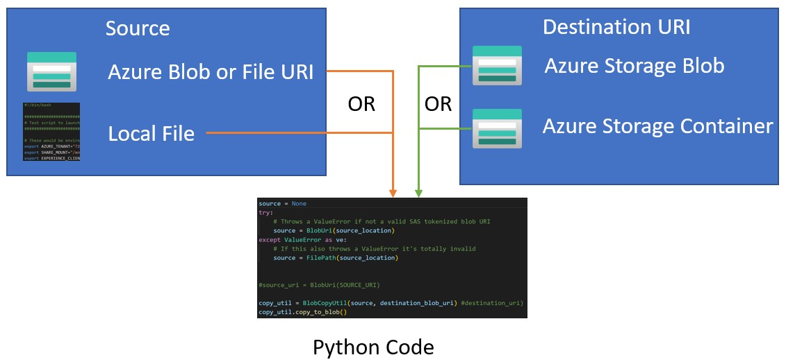

# File movement in Azure

There are many options for moving data into an Azure storage account. If you are looking for bulk uploading then your first look should be at [azcopy](https://docs.microsoft.com/en-us/azure/storage/common/storage-use-azcopy-v10). 

However, there are times when the movement can be user initiated and must be a little more flexible. 

The Python code in this repository is for just such a case. Let's suppose you have an application in which the user can choose to move a file into or around Azure storage that is either:

1. A file local to their machine (including mapped File Shares)
2. A file stored in an Azure Blob or File Share location

They would like to move it by identifying one of the following:

1. A specific Azure Blob URI
2. A URI that identifies just a container within an Azure Blob Storage account. 

This example can be summed up with this image. See storagecopy.py for a working example. 

# Pre-requisites

1. An Azure subscription with 1 or more storage accounts. 
2. Create a conda environment
> conda env create -f environment.yml
> conda activate StorageTest
3. Collect information from your storage account
    - A URL to an existing blob, with SAS token attached or the local disk path of a file.
    - A URL to a storage container with or without the blob name associated with it, also with a SAS token attached.

> <b> NOTE: </b> You might be wondering why you need SAS tokens on your Azure Storage URI's. It's simply because the source does not use any Azure Identity to accomplish the move, it relies solely on the authorization in the SAS token. 

